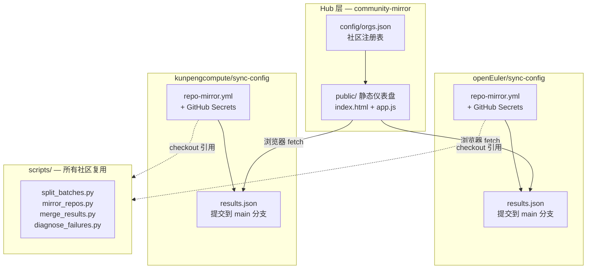
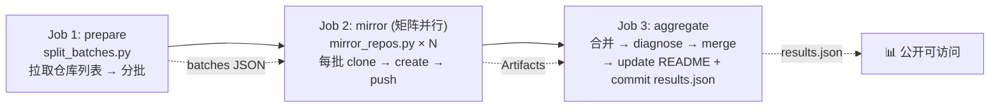

# community-mirror

跨社区开源仓库同步状态中心 — **由各社区自行运行同步，Hub 统一展示状态**。

👉 **[查看同步仪表盘](https://huanglei0308.github.io/community-mirror/)**

---

## 这是什么？

很多开源社区需要把代码从 Gitcode/Gitee 镜像到 GitHub，或反过来。这个项目解决两个问题：

1. **对于有同步需求的社区** — 提供开箱即用的模板，3 步配置好自动同步
2. **对于想了解同步状态的人** — 一个统一的仪表盘，展示所有社区的同步进展

## 实时同步状态

<!-- STATUS_TABLE_START -->
**Overall:** ⚠️ **24 failed** | **2** communities | **152** repos

| Community | Total | ✅ Synced | ❌ Failed | ⏭️ Skipped |
|-----------|------:|----------:|----------:|-----------:|
| ✅ openEuler | 1 | 1 | 0 | 0 |
| ⚠️ Kunpeng+BoostKit | 151 | 127 | 24 | 0 |

<!-- STATUS_TABLE_END -->

## 已接入社区

<!-- COMMUNITY_TABLE_START -->
| 社区 | 源 | 目的 | 负责人 | 状态 |
|------|-----|------|--------|------|
| openEuler | gitcode/openeuler | github/openeuler-mirror | @huanglei 30082796 | [查看](https://github.com/openeuler-mirror/sync-config#sync-status) |
| Kunpeng+BoostKit | gitcode/kunpengcompute | github/kunpengcompute | @huanglei 30082796 | [查看](https://github.com/kunpengcompute/sync-config#sync-status) |
<!-- COMMUNITY_TABLE_END -->

> 你的社区也在这里？见下方接入指南。

---

## 我要接入同步

→ 完整教程见 [docs/setup-guide.md](docs/setup-guide.md)

### Quick Start

**前置条件：** 源平台和目标平台的账号、API Token、SSH 密钥对。

---

#### Step 1: 创建 sync-config 仓库

在你的目标 GitHub 组织下创建一个仓库（建议命名 `sync-config`），用于存放同步 workflow 和展示同步状态。

#### Step 2: 复制 workflow 模板

将以下两个文件复制到你的仓库：

| 文件 | 位置 |
|------|------|
| [`template/repo-mirror.yml`](template/repo-mirror.yml) | `.github/workflows/repo-mirror.yml` |
| [`template/update_readme.py`](template/update_readme.py) | `update_readme.py`（仓库根目录） |

修改 workflow 中的以下内容：

```yaml
# 改这三处
src: gitcode/YOUR_ORG           # 源，如 gitcode/openeuler
dst: github/YOUR_ORG_MIRROR      # 目的，如 github/openeuler-mirror
account_type: org                # org / user / group

# 可选配置
# static_list: "repo1,repo2"     # 只同步指定仓库
# black_list: "huge-repo"        # 不同步这些仓库
# timeout: '1h'                  # 大仓库需要更长超时
# 目标为 Gitee/GitHub 且分支保护阻止 force push 时，可在 mirror_repos.py 参数中追加 --clear-branch-rules
# 注意：GitHub secret scanning push protection 不是分支保护，不能靠此参数绕过。
```

> ⚠️ **大型组织（>100 仓库）：** 模板默认使用**矩阵分批**策略，自动将仓库分成每批 80 个并行同步，避免单个 job 超时（GitHub Actions 6 小时限制）。小型组织可直接使用，分批逻辑在仓库少时自动退化为单个 job。

支持的平台前缀：`github`、`gitee`、`gitcode`、`gitlab`

#### Step 3: 配置 Secrets

在仓库 **Settings → Secrets and variables → Actions** 中添加：

| Secret | 说明 |
|--------|------|
| `SRC_TOKEN` | 源平台 API Token（用于获取仓库列表。Gitcode/Gitee 需要，GitHub 公开仓库可不填） |
| `DST_TOKEN` | 目标平台 API Token（用于创建仓库） |
| `DST_PRIVATE_KEY` | SSH 私钥（对应公钥需配在源和目标平台） |

#### Step 4: 配置 SSH 公钥

生成一对 SSH 密钥（如果没有的话）：

```bash
ssh-keygen -t rsa -b 4096 -f ~/.ssh/mirror-key -N ""
```

- **公钥**（`mirror-key.pub`）添加到：
  - 源平台：Gitcode → 设置 → SSH 密钥、Gitee → 设置 → SSH 公钥
  - 目标平台：GitHub → Settings → SSH and GPG keys
- **私钥**（`mirror-key`）内容作为 `DST_PRIVATE_KEY` Secret

#### Step 5: 修改仓库设置

⚠️ **以下设置很重要：**

**Actions 写权限**：Settings → Actions → General → Workflow permissions → 选择 **"Read and write permissions"** → Save

#### Step 6: 测试

1. 确保仓库默认分支为 `main`
2. 手动触发 workflow：Actions → **"Mirror repos"** → Run workflow
3. 等 workflow 跑完，检查：
   - 仓库 README 是否显示了同步状态
   - `https://raw.githubusercontent.com/<your-org>/<repo>/main/results.json` 是否可访问

#### Step 7: 注册到 Hub

向本仓库的 [`config/orgs.json`](config/orgs.json) 添加你的社区信息并提 PR（注意 `BRANCH` 替换为你的默认分支名，如 `main` 或 `master`）：

```json
{
  "org": "你的社区名",
  "owner": "目标 GitHub 组织名",
  "contact": "负责人 GitHub 账号",
  "source": "gitcode/my-org",
  "destination": "github/my-org-mirror",
  "results_url": "https://raw.githubusercontent.com/my-org/sync-config/main/results.json"
}
```

PR 合并后，你的社区会自动出现在 [仪表盘](https://huanglei0308.github.io/community-mirror/) 和上方状态表中。

---

### 常见问题

**Q: Hub 需要我的密钥吗？**
不需要。密钥放在你自己的仓库 Secrets 里，Hub 完全不碰。

**Q: 支持哪些平台？**
GitHub、Gitee、Gitcode、GitLab。基于自研的 `mirror_repos.py`（从 hub-mirror-action 核心逻辑 fork 并增强）。

**Q: 同步失败了怎么办？**
仪表盘和 README 会自动显示失败仓库及**错误分类**（如 "File Too Large"、"Push Protection Blocked" 等），一目了然。常见原因：源端仓库超大文件（>100MB）、GitHub push protection 拦截、pre-receive hook 拒绝、网络超时。

**Q: 仓库太多（800+），一个 workflow 跑不完就被终止了（⚠️ 叹号）？**
这是 GitHub Actions 的 6 小时限制。模板已内置**矩阵分批**策略：自动拉取仓库列表 → 分成每批 80 个 → 多个 job 并行同步 → 最后汇总。无需额外配置。

**Q: 我不用 Gitcode，用 Gitee，可以吗？**
可以。模板中的 `src` 和 `dst` 改成你的平台即可，比如 `src: gitee/my-org`。

**Q: workflow 跑完报 "Permission denied to github-actions[bot]"?**
→ 检查 **Step 5.1**，确保 Actions 有 Read and write permissions。

**Q: 仪表盘显示 "NO DATA"?**
→ 确认 `results_url` 可公开访问，且 workflow 已成功将 results.json 提交到 main 分支。

**Q: 我的仓库是私有的，results.json 会暴露吗?**
→ results.json 只包含仓库名和计数，不含源码，公开无安全风险。

## 如何工作？

### 系统架构



> **核心脚本都在 `community-mirror/scripts/`**，各社区 workflow 通过 `actions/checkout` 引用 `huanglei0308/community-mirror`，无需自行维护。
>
> 🔗 **[查看完整架构图（含 workflow 流程、数据流、错误分类）](docs/architecture.html)**

### 单社区 Workflow 流程（3 阶段）



> ⚠️ **为什么需要分批？** GitHub Actions 单个 job 有 6 小时限制。openEuler 有 824 个仓库，不分批必然会超时。矩阵策略将仓库分成每 80 个一批并行同步，彻底解决超时问题。


## 文件结构

```
community-mirror/
├── README.md               ← 你在这里
├── docs/
│   ├── setup-guide.md      ← 新社区接入教程
│   └── architecture.html   ← 架构图 & 流程图（浏览器打开）
├── template/               ← 复制到你仓库就能用
│   ├── repo-mirror.yml     ← 支持分批的 workflow 模板
│   └── update_readme.py    ← 更新 README 同步状态的脚本
├── scripts/                ← 所有社区复用
│   ├── mirror_repos.py     ← 核心：仓库镜像 + 直接输出 results.json
│   ├── merge_results.py    ← 合并多个 workflow 的结果
│   ├── diagnose_failures.py ← 诊断失败原因
│   └── split_batches.py    ← 大型组织自动分批
├── config/
│   └── orgs.json           ← 社区注册表 (接入时 PR 改这个)
├── public/                 ← gh-pages 仪表盘
│   ├── index.html
│   ├── app.js
│   └── style.css
└── .github/workflows/
    └── deploy-pages.yml
```
